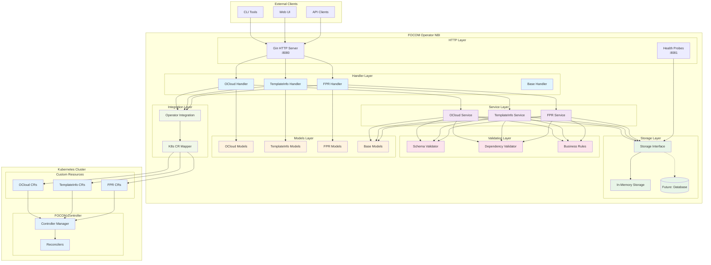

# FOCOM REST NBI Testing Guide

This guide provides step-by-step instructions for testing the FOCOM REST North Bound Interface (NBI) endpoints with the latest OpenAPI-compliant implementation.

## 🎯 Latest Updates (v1.1.0)

- ✅ **OpenAPI Compliance**: All endpoints now use OpenAPI-compliant field names
- ✅ **New API Versioning**: `/api/v1` prefix for all resource endpoints
- ✅ **Improved Response Format**: List endpoints return arrays directly (no wrapper objects)
- ✅ **Backward Compatibility**: Legacy endpoints still supported
- ✅ **Enhanced Field Names**: Resource-specific ID and state field names

## Architecture Overview

The FOCOM Operator NBI follows a layered architecture with clear separation of concerns:



### Component Responsibilities

#### **HTTP Layer**
- **Gin HTTP Server**: Handles REST API requests on port 8080
- **Health Probes**: Provides health and readiness checks on port 8081

#### **Handler Layer**
- **Resource Handlers**: Process HTTP requests for each resource type (OCloud, TemplateInfo, FPR)
- **Base Handler**: Common HTTP response utilities and error handling

#### **Service Layer**
- **Business Logic**: Orchestrates operations, validation, and storage interactions
- **Draft Workflow**: Manages DRAFT → VALIDATED → APPROVED state transitions

#### **Validation Layer**
- **Schema Validator**: Validates JSON structure and field constraints
- **Dependency Validator**: Ensures resource dependencies exist and are valid
- **Business Rules**: Enforces domain-specific validation rules

#### **Storage Layer**
- **Storage Interface**: Abstraction for different storage backends
- **In-Memory Storage**: Current implementation for development/testing
- **Future Database**: Planned persistent storage backend

#### **Models Layer**
- **Resource Models**: Data structures for OCloud, TemplateInfo, and FPR
- **Base Models**: Common fields and behaviors (ID, state, timestamps)

#### **Integration Layer**
- **Operator Integration**: Bridges NBI with Kubernetes controller
- **CR Mapper**: Converts NBI models to Kubernetes Custom Resources

### Resource Management Flow

The NBI implements a draft-based workflow for all resources:

1. **Draft Creation**: Create a new resource in DRAFT state
2. **Draft Updates**: Modify draft resources (only allowed in DRAFT state)
3. **Validation**: Validate draft against schema and business rules
4. **Approval**: Promote validated draft to APPROVED state
5. **Revision Management**: Track all approved versions as revisions
6. **Kubernetes Integration**: Create corresponding Custom Resources

## Prerequisites

- Go 1.23+ installed
- FOCOM operator built and running
- Access to the NBI REST API (default port: 8080)
- `jq` tool for JSON formatting (required for examples in this guide)
- For Kubernetes deployment: `kubectl` configured with cluster access

### Installing jq
```bash
# Ubuntu/Debian
sudo apt-get install jq

# macOS
brew install jq

# Or download from: https://jqlang.github.io/jq/download/
```

## Starting the FOCOM Operator with NBI

### Option 1: Run from Source
```bash
cd operators/focom-operator
go run cmd/main.go --enable-nbi=true --nbi-port=8080
```

### Option 2: Build and Run
```bash
cd operators/focom-operator
make build
./bin/manager --enable-nbi=true --nbi-port=8080
```

### Option 3: Deploy to Kubernetes
```bash
cd operators/focom-operator
make deploy

# The NBI will be available via the service:
# Service: focom-operator-controller-manager-nbi-service
# Port: 8080
# Namespace: focom-operator-system

# To access the NBI from outside the cluster, use port-forward:
kubectl port-forward -n focom-operator-system service/focom-operator-controller-manager-nbi-service 8080:8080

# Or create a NodePort/LoadBalancer service for external access
```

### Option 4: Build from Source
```bash
cd operators/focom-operator
make build
./focom-operator --enable-nbi=true --nbi-port=8080
```

### Option 3: Using Environment Variables
```bash
export NBI_PORT=8080
export NBI_STAGE=1
export NBI_STORAGE_BACKEND=memory
cd operators/focom-operator
go run cmd/main.go --enable-nbi=true
```

## API Base URLs

Once running, the API will be available at:

### New OpenAPI v1 Endpoints (Recommended)
```
http://localhost:8080/api/v1
```

### Legacy Endpoints (Backward Compatibility)
```
http://localhost:8080
```

### Operational Endpoints
```
http://localhost:8080/          # API info
http://localhost:8080/health/*  # Health checks
http://localhost:8080/metrics   # Metrics
```

## Testing the API Endpoints

### 1. Verify API Access

#### For Local Development:
```bash
# Check API info
curl -X GET http://localhost:8080/ | jq

# Check health
curl -X GET http://localhost:8080/health/live

# Test OpenAPI v1 endpoint
curl -X GET http://localhost:8080/api/v1/o-clouds | jq
```

#### For Kubernetes Deployment:
```bash
# Quick test using the provided script
./scripts/test-nbi-k8s.sh

# Or manual testing:
# Check if the operator is running
kubectl get pods -n focom-operator-system

# Check if the NBI service is created
kubectl get svc -n focom-operator-system focom-operator-controller-manager-nbi-service

# Port-forward to access the NBI
kubectl port-forward -n focom-operator-system service/focom-operator-controller-manager-nbi-service 8080:8080 &

# Test the API (same commands as local development)
curl -X GET http://localhost:8080/ | jq
curl -X GET http://localhost:8080/api/v1/o-clouds | jq
```

### 2. Health Check and API Info

#### Check API Info
```bash
curl -X GET http://localhost:8080/ | jq
```

**Expected Response:**
```json
{
  "name": "FOCOM REST NBI",
  "version": "v1alpha1",
  "description": "FOCOM North Bound Interface REST API",
  "timestamp": "2025-01-20T10:30:00Z"
}
```

#### Health Check
```bash
curl -X GET http://localhost:8080/health/live
curl -X GET http://localhost:8080/health/ready
```

### 2. OCloud Management

#### Create OCloud Draft
```bash
# Using new OpenAPI v1 endpoint (recommended)
curl -X POST http://localhost:8080/api/v1/o-clouds/draft \
  -H "Content-Type: application/json" \
  -d '{
    "namespace": "focom-operator-system",
    "name": "ocloud-1",
    "description": "Test OCloud for demonstration",
    "o2imsSecret": {
      "secretRef": {
        "name": "ocloud-kubeconfig",
        "namespace": "default"
      }
    }
  }' | jq
```

**Expected Response (New OpenAPI Format):**
```json
{
  "oCloudId": "550e8400-e29b-41d4-a716-446655440000",
  "oCloudRevisionState": "DRAFT",
  "revisionId": "550e8400-e29b-41d4-a716-446655440001",
  "namespace": "default",
  "name": "my-ocloud",
  "description": "Test OCloud for demonstration",
  "createdAt": "2025-10-21T15:30:00Z",
  "updatedAt": "2025-10-21T15:30:00Z",
  "o2imsSecret": {
    "secretRef": {
      "name": "ocloud-secret",
      "namespace": "default"
    }
  }
}
```

**Save the `oCloudId` from the response for subsequent operations!**

#### Legacy Endpoint (Backward Compatibility)
```bash
# Legacy endpoint still works with new field names
curl -X POST http://localhost:8080/o-clouds/draft \
  -H "Content-Type: application/json" \
  -d '{ ... same payload ... }' | jq
```

#### Get OCloud Draft
```bash
# Replace {ocloud-id} with the actual oCloudId from the create response
curl -X GET http://localhost:8080/api/v1/o-clouds/{ocloud-id}/draft | jq
```

#### Update OCloud Draft
```bash
curl -X PATCH http://localhost:8080/api/v1/o-clouds/{ocloud-id}/draft \
  -H "Content-Type: application/json" \
  -d '{
    "description": "Updated OCloud description - Version 2",
    "o2imsSecret": {
      "secretRef": {
        "name": "updated-ocloud-secret",
        "namespace": "default"
      }
    }
  }' | jq
```

#### Validate OCloud Draft
```bash
curl -X POST http://localhost:8080/api/v1/o-clouds/{ocloud-id}/draft/validate | jq
```

**Expected Response:**
```json
{
  "draft": {
    "oCloudId": "550e8400-e29b-41d4-a716-446655440000",
    "oCloudRevisionState": "VALIDATED",
    "name": "my-ocloud",
    "description": "Updated OCloud description - Version 2",
    ...
  },
  "validationResult": {
    "success": true,
    "validationTime": "2025-10-21T15:35:00Z"
  }
}
```

#### Approve OCloud Draft
```bash
curl -X POST http://localhost:8080/api/v1/o-clouds/{ocloud-id}/draft/approve | jq
```

#### Reject OCloud Draft (Testing Scenario)
```bash
curl -X POST http://localhost:8080/api/v1/o-clouds/{ocloud-id}/draft/reject \
  -H "Content-Type: application/json" \
  -d '{
    "reason": "Description needs more detail"
  }' | jq
```

**Expected Response:**
```json
{
  "draft": {
    "oCloudId": "550e8400-e29b-41d4-a716-446655440000",
    "oCloudRevisionState": "DRAFT",
    ...
  },
  "reason": "Description needs more detail",
  "rejected": true
}
```

#### Get Approved OCloud
```bash
curl -X GET http://localhost:8080/api/v1/o-clouds/{ocloud-id} | jq
```

**Expected Response:**
```json
{
  "oCloudId": "550e8400-e29b-41d4-a716-446655440000",
  "oCloudRevisionState": "APPROVED",
  "name": "my-ocloud",
  "description": "Updated OCloud description - Version 2",
  ...
}
```

#### List All OClouds (New Array Format)
```bash
curl -X GET http://localhost:8080/api/v1/o-clouds | jq
```

**Expected Response (Direct Array):**
```json
[
  {
    "oCloudData": {
      "oCloudId": "550e8400-e29b-41d4-a716-446655440000",
      "oCloudRevisionState": "APPROVED",
      "name": "my-ocloud",
      ...
    },
    "oCloudStatus": {
      "message": "Active"
    }
  }
]
```

#### Get OCloud Revisions
```bash
curl -X GET http://localhost:8080/api/v1/o-clouds/{ocloud-id}/revisions | jq
```

**Expected Response (Direct Array):**
```json
[
  {
    "resourceId": "550e8400-e29b-41d4-a716-446655440000",
    "revisionId": "550e8400-e29b-41d4-a716-446655440001",
    "resourceType": "OCloud",
    "revisionData": {
      "oCloudId": "550e8400-e29b-41d4-a716-446655440000",
      "oCloudRevisionState": "APPROVED",
      ...
    },
    "approvedAt": "2025-10-21T15:35:00Z"
  }
]
```

#### Create New Draft from Revision (Multiple Revisions)
```bash
curl -X POST http://localhost:8080/api/v1/o-clouds/{ocloud-id}/revisions/{revision-id}/draft | jq
```

### 3. TemplateInfo Management

#### Create TemplateInfo Draft
```bash
curl -X POST http://localhost:8080/api/v1/template-infos/draft \
  -H "Content-Type: application/json" \
  -d '{
    "namespace": "focom-operator-system",
    "name": "nephio-workload-cluster-v1.0.0",
    "description": "Kubernetes cluster template",
    "templateName": "nephio-workload-cluster",
    "templateVersion": "v1.0.0",
    "templateParameterSchema": "{\"type\":\"object\",\"infra\":{\"param1\":{\"type\":\"string\"},\"params\":{\"type\":\"integer\"}},\"required\":[\"param1\"]}"
  }' | jq
```

**Note**: The `templateParameterSchema` is flexible and can define any JSON schema. When FPRs are validated, they will be validated against this specific schema, not hardcoded rules.

**Expected Response:**
```json
{
  "templateInfoId": "1b14cda2-ec47-409e-93c6-8b9a0ea933db",
  "templateInfoRevisionState": "DRAFT",
  "revisionId": "31460f93-7304-4918-8de3-ce95db033c57",
  "namespace": "focom-operator-system",
  "name": "nephio-workload-cluster-v1.0.0",
  "description": "Kubernetes cluster template",
  "createdAt": "2025-10-22T10:29:27.261174626Z",
  "updatedAt": "2025-10-22T10:29:27.261174626Z",
  "templateName": "nephio-workload-cluster",
  "templateVersion": "v",
  "templateParameterSchema": "{\"type\":\"object\",\"infra\":{\"param1\":{\"type\":\"string\"},\"params\":{\"type\":\"integer\"}},\"required\":[\"param1\"]}"
}
```

**Save the `templateInfoId` from the response!**

#### Validate and Approve TemplateInfo
```bash
# Validate
curl -X POST http://localhost:8080/api/v1/template-infos/{template-id}/draft/validate | jq

# Approve
curl -X POST http://localhost:8080/api/v1/template-infos/{template-id}/draft/approve | jq
```

#### List TemplateInfos (New Array Format)
```bash
curl -X GET http://localhost:8080/api/v1/template-infos | jq
```

**Expected Response:**
```json
[
  {
    "templateInfoData": {
      "templateInfoId": "660e8400-e29b-41d4-a716-446655440000",
      "templateInfoRevisionState": "APPROVED",
      "templateName": "k8s-cluster",
      "templateVersion": "v1.0.0",
      ...
    },
    "templateInfoStatus": {
      "message": "Active"
    }
  }
]
```

### 4. FocomProvisioningRequest Management

**Note:** You need approved OCloud and TemplateInfo resources before creating FPRs. The `templateParameters` will be validated against the schema defined in the TemplateInfo resource.

#### Create FPR Draft
```bash
curl -X POST http://localhost:8080/api/v1/focom-provisioning-requests/draft \
  -H "Content-Type: application/json" \
  -d '{
    "namespace": "focom-operator-system",
    "name": "focom-cluster-prov-req-nephio",
    "description": "Test provisioning request",
    "oCloudId": "ocloud-1",
    "oCloudNamespace": "focom-operator-system",
    "templateName": "nephio-workload-cluster",
    "templateVersion": "v1.0.0",
    "templateParameters": {
        "clusterName": "edge",
        "labels": {
            "nephio.org/site-type": "edge",
            "nephio.org/region": "europe-paris-west",
            "nephio.org/owner": "nephio-o2ims"
        }
    }
  }' | jq
```

**Expected Response:**
```json
{
  "provisioningRequestId": "0f371d46-a7b2-48c7-90d4-078c01a6cd19",
  "focomProvisioningRequestRevisionState": "DRAFT",
  "revisionId": "cbcadf1d-4d68-4196-90a7-3e1653f14dc7",
  "namespace": "focom-operator-system",
  "name": "focom-cluster-prov-req-nephio",
  "description": "Test provisioning request",
  "createdAt": "2025-10-22T10:32:50.808455344Z",
  "updatedAt": "2025-10-22T10:32:50.808455344Z",
  "oCloudId": "ocloud-1",
  "oCloudNamespace": "focom-operator-system",
  "templateName": "nephio-workload-cluster",
  "templateVersion": "main",
  "templateParameters": {
    "clusterName": "edge-2",
    "labels": {
      "nephio.org/owner": "nephio-o2ims",
      "nephio.org/region": "europe-paris-west",
      "nephio.org/site-type": "edge"
    }
  }
}
```

**Save the `provisioningRequestId` from the response!**

#### Validate and Approve FPR
```bash
# Validate (checks dependencies)
curl -X POST http://localhost:8080/api/v1/focom-provisioning-requests/{fpr-id}/draft/validate | jq

# Approve (will validate dependencies)
curl -X POST http://localhost:8080/api/v1/focom-provisioning-requests/{fpr-id}/draft/approve | jq
```

#### List FPRs (New Array Format)
```bash
curl -X GET http://localhost:8080/api/v1/focom-provisioning-requests | jq
```

**Expected Response:**
```json
[
  {
    "provisioningRequestId": "770e8400-e29b-41d4-a716-446655440000",
    "focomProvisioningRequestRevisionState": "APPROVED",
    "oCloudId": "{ocloud-id}",
    "templateName": "k8s-cluster",
    "templateParameters": {
      "clusterName": "test-cluster-v1",
      "nodeCount": 3
    },
    ...
  }
]
```

#### Test Multiple Revisions
```bash
# Create new draft from existing revision
curl -X POST http://localhost:8080/api/v1/focom-provisioning-requests/{fpr-id}/revisions/{revision-id}/draft | jq

# Update the draft
curl -X PATCH http://localhost:8080/api/v1/focom-provisioning-requests/{fpr-id}/draft \
  -H "Content-Type: application/json" \
  -d '{
    "description": "Updated FPR - Version 2",
    "templateParameters": {
      "clusterName": "test-cluster-v2",
      "nodeCount": 5
    }
  }' | jq

# Validate and approve to create second revision
curl -X POST http://localhost:8080/api/v1/focom-provisioning-requests/{fpr-id}/draft/validate | jq
curl -X POST http://localhost:8080/api/v1/focom-provisioning-requests/{fpr-id}/draft/approve | jq

# View all revisions
curl -X GET http://localhost:8080/api/v1/focom-provisioning-requests/{fpr-id}/revisions | jq
```

## Complete Workflow Example

Here's a complete workflow script using the new OpenAPI v1 endpoints:

```bash
#!/bin/bash

BASE_URL="http://localhost:8080/api/v1"
LEGACY_URL="http://localhost:8080"

echo "=== Testing FOCOM REST NBI with OpenAPI v1 Endpoints ==="

# 1. Check API health
echo "1. Checking API health..."
curl -s "$LEGACY_URL/health/live" | jq .
curl -s "$LEGACY_URL/" | jq .

# 2. Create OCloud
echo "2. Creating OCloud draft..."
OCLOUD_RESPONSE=$(curl -s -X POST "$BASE_URL/o-clouds/draft" \
  -H "Content-Type: application/json" \
  -d '{
    "namespace": "default",
    "name": "test-ocloud-v1",
    "description": "Test OCloud with OpenAPI fields",
    "o2imsSecret": {
      "secretRef": {
        "name": "test-secret",
        "namespace": "default"
      }
    }
  }')

OCLOUD_ID=$(echo "$OCLOUD_RESPONSE" | jq -r '.oCloudId')
echo "Created OCloud with ID: $OCLOUD_ID"
echo "$OCLOUD_RESPONSE" | jq .

# 3. Validate and approve OCloud
echo "3. Validating OCloud..."
curl -s -X POST "$BASE_URL/o-clouds/$OCLOUD_ID/draft/validate" | jq .

echo "4. Approving OCloud..."
curl -s -X POST "$BASE_URL/o-clouds/$OCLOUD_ID/draft/approve" | jq .

# 5. Create TemplateInfo
echo "5. Creating TemplateInfo draft..."
TEMPLATE_RESPONSE=$(curl -s -X POST "$BASE_URL/template-infos/draft" \
  -H "Content-Type: application/json" \
  -d '{
    "namespace": "default",
    "name": "cluster-template-v1",
    "description": "Kubernetes cluster template",
    "templateName": "k8s-cluster",
    "templateVersion": "v1.0.0",
    "templateParameterSchema": "{\"type\":\"object\",\"properties\":{\"clusterName\":{\"type\":\"string\"},\"nodeCount\":{\"type\":\"integer\",\"minimum\":1,\"maximum\":10}},\"required\":[\"clusterName\",\"nodeCount\"]}"
  }')

TEMPLATE_ID=$(echo "$TEMPLATE_RESPONSE" | jq -r '.templateInfoId')
echo "Created TemplateInfo with ID: $TEMPLATE_ID"

# 6. Validate and approve TemplateInfo
echo "6. Validating and approving TemplateInfo..."
curl -s -X POST "$BASE_URL/template-infos/$TEMPLATE_ID/draft/validate" | jq .validationResult
curl -s -X POST "$BASE_URL/template-infos/$TEMPLATE_ID/draft/approve" | jq .approved

# 7. Create FPR
echo "7. Creating FocomProvisioningRequest draft..."
FPR_RESPONSE=$(curl -s -X POST "$BASE_URL/focom-provisioning-requests/draft" \
  -H "Content-Type: application/json" \
  -d "{
    \"namespace\": \"default\",
    \"name\": \"test-fpr-v1\",
    \"description\": \"Test FPR with OpenAPI fields\",
    \"oCloudId\": \"$OCLOUD_ID\",
    \"oCloudNamespace\": \"default\",
    \"templateName\": \"k8s-cluster\",
    \"templateVersion\": \"v1.0.0\",
    \"templateParameters\": {
      \"clusterName\": \"test-cluster-v1\",
      \"nodeCount\": 3
    }
  }")

FPR_ID=$(echo "$FPR_RESPONSE" | jq -r '.provisioningRequestId')
echo "Created FPR with ID: $FPR_ID"

# 8. Validate and approve FPR
echo "8. Validating and approving FPR..."
curl -s -X POST "$BASE_URL/focom-provisioning-requests/$FPR_ID/draft/validate" | jq .validationResult
curl -s -X POST "$BASE_URL/focom-provisioning-requests/$FPR_ID/draft/approve" | jq .approved

# 9. Test multiple revisions
echo "9. Testing multiple revisions..."
# Get current revisions
echo "Current revisions:"
curl -s "$BASE_URL/focom-provisioning-requests/$FPR_ID/revisions" | jq 'length'

# Create new draft from revision
REVISION_ID=$(curl -s "$BASE_URL/focom-provisioning-requests/$FPR_ID/revisions" | jq -r '.[0].revisionId')
echo "Creating new draft from revision: $REVISION_ID"
curl -s -X POST "$BASE_URL/focom-provisioning-requests/$FPR_ID/revisions/$REVISION_ID/draft" | jq .

# Update and approve to create second revision
echo "Updating draft for version 2..."
curl -s -X PATCH "$BASE_URL/focom-provisioning-requests/$FPR_ID/draft" \
  -H "Content-Type: application/json" \
  -d '{
    "description": "Updated FPR - Version 2",
    "templateParameters": {
      "clusterName": "test-cluster-v2",
      "nodeCount": 5
    }
  }' | jq .

curl -s -X POST "$BASE_URL/focom-provisioning-requests/$FPR_ID/draft/validate" | jq .validationResult
curl -s -X POST "$BASE_URL/focom-provisioning-requests/$FPR_ID/draft/approve" | jq .approved

echo "Final revision count:"
curl -s "$BASE_URL/focom-provisioning-requests/$FPR_ID/revisions" | jq 'length'

# 10. List all resources (new array format)
echo "10. Listing all resources..."
echo "OClouds (count):"
curl -s "$BASE_URL/o-clouds" | jq 'length'
echo "TemplateInfos (count):"
curl -s "$BASE_URL/template-infos" | jq 'length'
echo "FPRs (count):"
curl -s "$BASE_URL/focom-provisioning-requests" | jq 'length'

# 11. Check Kubernetes CRs
echo "11. Checking Kubernetes CRs..."
kubectl get focomprovisioningrequests -A

echo "=== Testing Complete ==="
```

## 🔄 Advanced Testing Scenarios

### Test Reject Workflow
```bash
# Create and validate a draft
curl -X POST http://localhost:8080/api/v1/o-clouds/draft \
  -H "Content-Type: application/json" \
  -d '{
    "namespace": "default",
    "name": "test-reject",
    "description": "Test reject workflow",
    "o2imsSecret": {
      "secretRef": {
        "name": "test-secret",
        "namespace": "default"
      }
    }
  }' | jq

# Get the oCloudId from response, then validate
curl -X POST http://localhost:8080/api/v1/o-clouds/{ocloud-id}/draft/validate | jq

# Reject the draft with reason
curl -X POST http://localhost:8080/api/v1/o-clouds/{ocloud-id}/draft/reject \
  -H "Content-Type: application/json" \
  -d '{
    "reason": "Description needs more technical details"
  }' | jq
```

### Test Multiple Revisions
```bash
# After approving a resource, create new draft from revision
curl -X POST http://localhost:8080/api/v1/focom-provisioning-requests/{fpr-id}/revisions/{revision-id}/draft | jq

# Update the draft
curl -X PATCH http://localhost:8080/api/v1/focom-provisioning-requests/{fpr-id}/draft \
  -H "Content-Type: application/json" \
  -d '{
    "description": "Version 2 with improvements",
    "templateParameters": {
      "clusterName": "production-cluster",
      "nodeCount": 10
    }
  }' | jq

# Approve to create second revision
curl -X POST http://localhost:8080/api/v1/focom-provisioning-requests/{fpr-id}/draft/validate | jq
curl -X POST http://localhost:8080/api/v1/focom-provisioning-requests/{fpr-id}/draft/approve | jq

# View revision history
curl -X GET http://localhost:8080/api/v1/focom-provisioning-requests/{fpr-id}/revisions | jq '[.[] | {revisionId: .revisionId, description: .revisionData.description, nodeCount: .revisionData.templateParameters.nodeCount}]'
```

## Error Testing

### Test Dependency Validation
```bash
# Try to create FPR with non-existent OCloud
curl -X POST http://localhost:8080/api/v1/focom-provisioning-requests/draft \
  -H "Content-Type: application/json" \
  -d '{
    "namespace": "default",
    "name": "invalid-fpr",
    "description": "FPR with invalid dependencies",
    "oCloudId": "non-existent-id",
    "oCloudNamespace": "default",
    "templateName": "non-existent-template",
    "templateVersion": "v1.0.0",
    "templateParameters": {
      "clusterName": "test",
      "nodeCount": 1
    }
  }' | jq
```

### Test Invalid Data
```bash
# Try to create OCloud with invalid data
curl -X POST http://localhost:8080/api/v1/o-clouds/draft \
  -H "Content-Type: application/json" \
  -d '{
    "name": "",
    "description": "Invalid OCloud"
  }' | jq
```

## Common HTTP Status Codes

- `200 OK` - Successful GET, PATCH, POST operations
- `201 Created` - Successful resource creation
- `204 No Content` - Successful DELETE operations
- `400 Bad Request` - Invalid request data or validation errors
- `404 Not Found` - Resource not found
- `409 Conflict` - Resource already exists or state conflict
- `500 Internal Server Error` - Server-side errors

## Troubleshooting

### Check Operator Logs
```bash
# If running from source
# Check the console output for any error messages

# If running as container
kubectl logs -f deployment/focom-operator -n focom-system
```

### Verify NBI is Enabled
```bash
# Check if the NBI port is accessible
curl -v http://localhost:8080/health/live
```

### Common Issues

1. **Connection Refused**: Ensure the operator is running with `--enable-nbi=true`
2. **404 on all endpoints**: Check that the NBI port is correct (default: 8080)
3. **Validation Errors**: Ensure all required fields are provided in requests
4. **Dependency Errors**: Create and approve OCloud and TemplateInfo before creating FPRs
5. **RBAC Permission Denied**: If you get "forbidden" errors when approving drafts, redeploy the operator:

```bash
# Redeploy the operator with updated RBAC (this should resolve the issue):
make deploy

# Verify permissions are correct:
kubectl auth can-i create oclouds --as=system:serviceaccount:focom-operator-system:focom-operator-controller-manager
kubectl auth can-i create templateinfoes --as=system:serviceaccount:focom-operator-system:focom-operator-controller-manager

# Both commands above should return "yes"
```

## Recent Updates

### Default Installation Improvements
- ✅ **RBAC Permissions**: Default installation now includes proper `create`, `update`, `patch`, `delete` permissions for OCloud and TemplateInfo resources
- ✅ **NBI Kubernetes Service**: Default deployment includes service to expose NBI port 8080
- ✅ **Enhanced Deployment**: Manager deployment includes proper NBI configuration out of the box

### Issues Resolved in Default Installation
- ✅ **RBAC Permission Denied**: Default `make deploy` now includes all required permissions
- ✅ **NBI Service Missing**: Default deployment includes NBI service exposure
- ✅ **Template Parameter Validation**: FPR validation now uses actual TemplateInfo schema instead of hardcoded rules

## Verify Default Installation

After running `make deploy`, verify that everything is working correctly:

```bash
# 1. Check operator is running
kubectl get pods -n focom-operator-system

# 2. Check NBI service is created
kubectl get svc -n focom-operator-system focom-operator-controller-manager-nbi-service

# 3. Verify RBAC permissions
kubectl auth can-i create oclouds --as=system:serviceaccount:focom-operator-system:focom-operator-controller-manager
kubectl auth can-i create templateinfoes --as=system:serviceaccount:focom-operator-system:focom-operator-controller-manager

# 4. Test NBI endpoints
kubectl port-forward -n focom-operator-system service/focom-operator-controller-manager-nbi-service 8080:8080 &
curl http://localhost:8080/api/v1/o-clouds | jq
```

All commands should succeed without errors.

## Next Steps

- Explore the OpenAPI specification at `operators/focom-operator/api/openapi/focom-nbi-api.yaml`
- Run the integration tests: `go test -v ./internal/nbi/*integration_test.go`
- Check the comprehensive test examples in the test files for more advanced scenarios
- Use the Kubernetes testing script: `./scripts/test-nbi-k8s.sh`