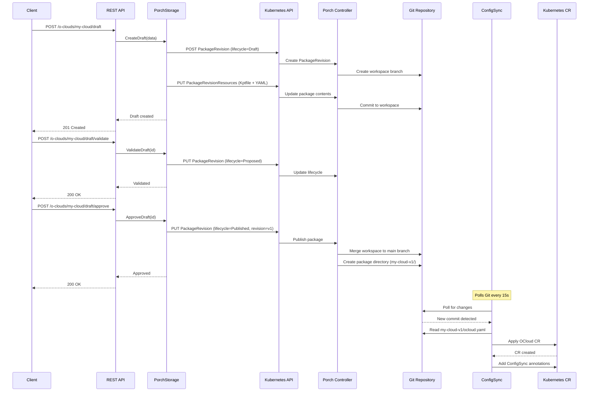
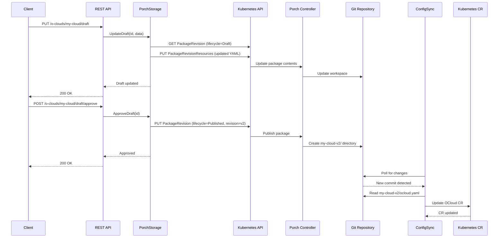
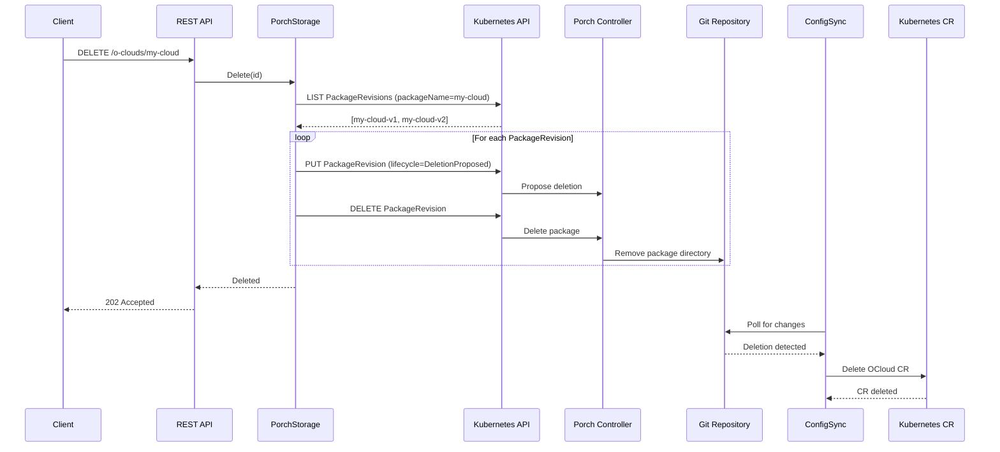
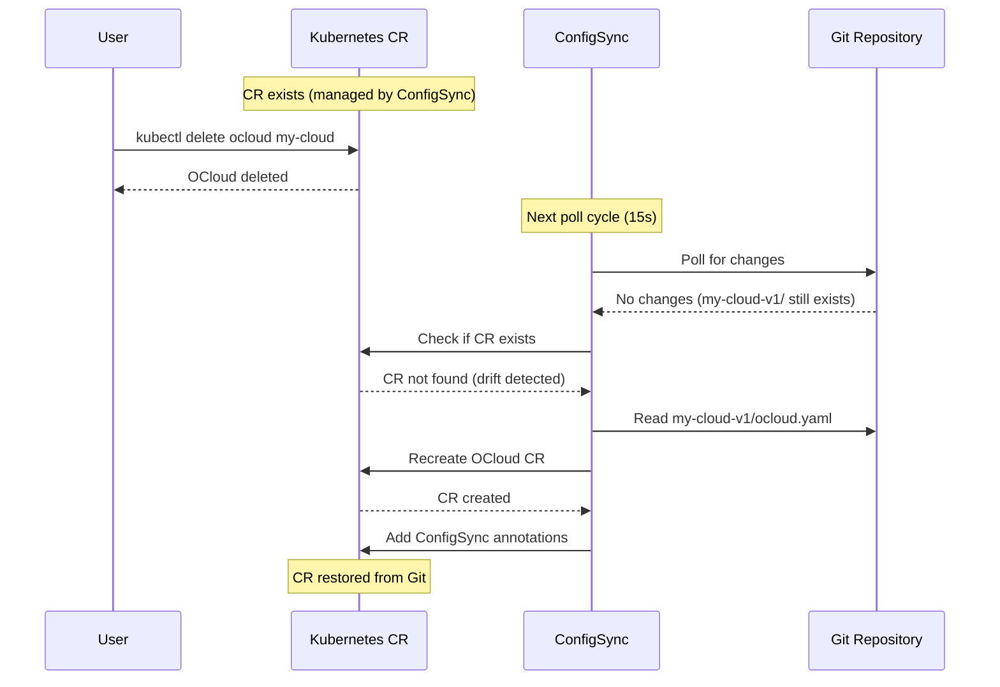

# FOCOM Operator Architecture

## Overview

The FOCOM (FOCOM Managed Infrastructure) Operator provides a REST API for managing O-RAN infrastructure resources with GitOps-based storage using Nephio Porch and ConfigSync. The system enables declarative management of OClouds, TemplateInfos, and FocomProvisioningRequests with full revision history and self-healing capabilities.

## Resource Model and Relationships

### Core Resources

The FOCOM operator manages three types of resources that work together to enable cluster provisioning:

#### 1. OCloud - "FOCOM's Knowledge About an O-Cloud"

**Purpose:** FOCOM's knowledge about an O-Cloud, including O2IMS endpoint and credentials. Also serves as the handle for associating TemplateInfo resources with that O-Cloud.

**Contains:**
- O-Cloud identification (name, ID)
- O2IMS endpoint and credentials (via `o2imsSecret`)
- (Future) Available sites and capacity information

**Analogy:** Like FOCOM's "address book entry" for an O-Cloud provider

**Lifecycle:** Created once by administrators, maintained as O-Cloud capabilities change

**Example:**
```yaml
apiVersion: focom.nephio.org/v1alpha1
kind: OCloud
metadata:
  name: edge-cloud-west
  namespace: focom-system
spec:
  o2imsSecret:
    secretRef:
      name: edge-cloud-west-credentials
      namespace: focom-system
```

#### 2. TemplateInfo - "Cached MIT Template Metadata"

**Purpose:** FOCOM's cached metadata about MIT templates available on a specific O-Cloud. The actual MIT templates are defined and owned by the O-Cloud.

**Contains:**
- Template identification (name, version)
- Template parameters
- Cluster characteristics (CPU, memory, features)

**Analogy:** Like FOCOM's "catalog entry" for what cluster types an O-Cloud can provide

**Lifecycle:** Created once by administrators, reused for multiple cluster deployments

**Example:**
```yaml
apiVersion: provisioning.oran.org/v1alpha1
kind: TemplateInfo
metadata:
  name: edge-cluster-template
  namespace: focom-system
spec:
  id: edge-cluster-v1
  version: "1.0.0"
  templateParameters:
    clusterType: "edge"
    defaultWorkerNodes: 3
```

#### 3. FocomProvisioningRequest - "Deploy This Cluster"

**Purpose:** The actual request to deploy a cluster using a specific template on a specific O-Cloud.

**Contains:**
- Reference to OCloud (where to deploy)
- Reference to TemplateInfo (what to deploy)
- User credentials (who gets access)
- Capability parameters (what features needed)
- Capacity parameters (how much resources needed)

**Analogy:** Like an "order" or "deployment request"

**Lifecycle:** Created each time a user wants to deploy a new cluster

**Example:**
```yaml
apiVersion: focom.nephio.org/v1alpha1
kind: FocomProvisioningRequest
metadata:
  name: deploy-edge-cluster-001
  namespace: focom-system
spec:
  ocloudRef:
    name: edge-cloud-west  # WHERE
  templateInfoRef:
    name: edge-cluster-template  # WHAT
  userCredentials:
    username: "admin"  # WHO
  capacityParameters:
    workerNodes: 3  # HOW MUCH
    cpuCores: 64
    memoryGB: 256
```

### Resource Relationship Diagram

```
┌─────────────────────────────────────────────────────────────┐
│                    Administrator Setup                       │
│                      (One-time)                              │
└─────────────────────────────────────────────────────────────┘

┌──────────────────┐         ┌──────────────────┐
│     OCloud       │         │   TemplateInfo   │
│  (edge-cloud-    │         │ (edge-cluster-   │
│   west)        │         │  template)       │
│                  │         │                  │
│ "WHERE to        │         │ "WHAT type of    │
│  deploy"         │         │  cluster"        │
└──────────────────┘         └──────────────────┘
         │                            │
         │                            │
         └────────────┬───────────────┘
                      │
                      │ References both
                      ▼
         ┌──────────────────────────┐
         │ FocomProvisioningRequest │
         │  (deploy-edge-cluster-   │
         │   001)                   │
         │                          │
         │ "DEPLOY this cluster"    │
         │  - WHERE: edge-cloud-    │
         │           west         │
         │  - WHAT:  edge-cluster-  │
         │           template       │
         │  - WHO:   admin          │
         │  - HOW MUCH: 3 nodes     │
         └──────────────────────────┘
                      │
                      │ Picked up by SBI
                      ▼
         ┌──────────────────────────┐
         │    SBI Team's Component  │
         │  (Watches FPR, calls     │
         │   O2IMS)                 │
         └──────────────────────────┘
```

### User Workflow

#### Step 1: Administrator Setup (One-time)

Administrators create the "catalog" of available O-Clouds and cluster templates:

**1.1 Create OClouds** (one per target infrastructure)
```bash
# Create OCloud for West edge site
POST /api/v1/o-clouds/draft
{
  "namespace": "focom-system",
  "name": "edge-cloud-west",
  "o2imsSecret": {
    "secretRef": {
      "name": "edge-cloud-west-credentials",
      "namespace": "focom-system"
    }
  }
}

# Validate and approve
POST /api/v1/o-clouds/edge-cloud-west/draft/validate
POST /api/v1/o-clouds/edge-cloud-west/draft/approve
```

**1.2 Create TemplateInfos** (one per cluster type)
```bash
# Create template for small edge clusters
POST /api/v1/template-infos/draft
{
  "namespace": "focom-system",
  "name": "edge-cluster-template",
  "version": "1.0.0",
  "templateParameters": {...}
}

# Validate and approve
POST /api/v1/template-infos/edge-cluster-template/draft/validate
POST /api/v1/template-infos/edge-cluster-template/draft/approve
```

#### Step 2: User Requests Cluster (Repeatable)

Users create FocomProvisioningRequests to deploy clusters:

```bash
# Request a new cluster deployment
POST /api/v1/focom-provisioning-requests/draft
{
  "namespace": "focom-system",
  "name": "deploy-edge-cluster-001",
  "ocloudRef": {
    "name": "edge-cloud-west"  # Use existing OCloud
  },
  "templateInfoRef": {
    "name": "edge-cluster-template"  # Use existing template
  },
  "userCredentials": {
    "username": "admin"
  },
  "capacityParameters": {
    "workerNodes": 3,
    "cpuCores": 64,
    "memoryGB": 256
  }
}

# Validate and approve
POST /api/v1/focom-provisioning-requests/deploy-edge-cluster-001/draft/validate
POST /api/v1/focom-provisioning-requests/deploy-edge-cluster-001/draft/approve
```

### Common Usage Scenarios

#### Scenario 1: Deploy Multiple Clusters to Same O-Cloud

```
1. Create OCloud: "edge-cloud-west" (once)
2. Create TemplateInfo: "edge-cluster-template" (once)
3. Create FPR: "deploy-cluster-001" → references west + template
4. Create FPR: "deploy-cluster-002" → references west + template
5. Create FPR: "deploy-cluster-003" → references west + template
```

#### Scenario 2: Deploy Same Template to Multiple O-Clouds

```
1. Create OCloud: "edge-cloud-west" (once)
2. Create OCloud: "edge-cloud-east" (once)
3. Create TemplateInfo: "edge-cluster-template" (once)
4. Create FPR: "deploy-west-cluster" → references west + template
5. Create FPR: "deploy-east-cluster" → references east + template
```

#### Scenario 3: Deploy Different Cluster Types

```
1. Create OCloud: "edge-cloud-west" (once)
2. Create TemplateInfo: "small-edge-template" (once)
3. Create TemplateInfo: "large-edge-template" (once)
4. Create FPR: "deploy-small-cluster" → references west + small-template
5. Create FPR: "deploy-large-cluster" → references west + large-template
```

### Key Design Principles

1. **Separation of Concerns:**
   - OClouds define infrastructure targets
   - TemplateInfos define cluster blueprints
   - FocomProvisioningRequests combine them for deployment

2. **Reusability:**
   - OClouds and TemplateInfos are created once, reused many times
   - Reduces duplication and ensures consistency

3. **Validation:**
   - FOCOM reconciler validates that referenced OClouds and TemplateInfos exist
   - Prevents invalid deployment requests

4. **Loose Coupling:**
   - FOCOM creates and validates CRs
   - SBI team watches FPRs and handles O2IMS communication
   - Clear separation of responsibilities

## High-Level Architecture

```
┌─────────────────────────────────────────────────────────────────┐
│                     External Clients                             │
│              (curl, UI, Automation Tools)                        │
└────────────────────────────┬────────────────────────────────────┘
                             │ HTTP REST (JSON)
                             ▼
┌─────────────────────────────────────────────────────────────────┐
│                   FOCOM NBI REST API                             │
│                  (Gin HTTP Server :8080)                         │
│                                                                   │
│  ┌──────────────┐  ┌──────────────┐  ┌──────────────┐          │
│  │   OCloud     │  │ TemplateInfo │  │     FPR      │          │
│  │   Handler    │  │   Handler    │  │   Handler    │          │
│  └──────┬───────┘  └──────┬───────┘  └──────┬───────┘          │
│         │                  │                  │                   │
│         └──────────────────┼──────────────────┘                  │
│                            │                                      │
│                            ▼                                      │
│                  ┌──────────────────┐                            │
│                  │ StorageInterface │                            │
│                  └──────────────────┘                            │
└────────────────────────────┬────────────────────────────────────┘
                             │
                ┌────────────┴────────────┐
                │                         │
                ▼                         ▼
    ┌──────────────────┐      ┌──────────────────┐
    │  InMemoryStorage │      │   PorchStorage   │
    │    (Stage 1)     │      │    (Stage 2)     │
    └──────────────────┘      └─────────┬────────┘
                                        │ HTTP REST
                                        ▼
                          ┌──────────────────────────┐
                          │   Kubernetes API Server  │
                          │  (Porch Extension API)   │
                          └────────────┬─────────────┘
                                       │
                                       ▼
                          ┌──────────────────────────┐
                          │    Porch Controller      │
                          │  (PackageRevision CRD)   │
                          └────────────┬─────────────┘
                                       │ Git Sync
                                       ▼
                          ┌──────────────────────────┐
                          │      Git Repository      │
                          │  (focom-resources.git)   │
                          └────────────┬─────────────┘
                                       │ Poll (15s)
                                       ▼
                          ┌──────────────────────────┐
                          │   ConfigSync (RootSync)  │
                          │ (config-management-sys)  │
                          └────────────┬─────────────┘
                                       │ Apply
                                       ▼
                          ┌──────────────────────────┐
                          │  Kubernetes CRs          │
                          │  (OCloud, TemplateInfo,  │
                          │   FocomProvisioningReq)  │
                          └──────────────────────────┘
```

## Component Details

### 1. FOCOM NBI REST API

**Purpose:** Provides HTTP REST API for managing FOCOM resources

**Technology:** Go + Gin HTTP framework

**Port:** 8080

**Key Features:**
- Draft-based workflow (create → validate → approve)
- Revision history management
- Dependency validation
- Error handling with standardized codes
- OpenAPI 3.0 specification

**Endpoints:**
- `/api/v1/o-clouds/*` - OCloud management
- `/api/v1/template-infos/*` - TemplateInfo management
- `/api/v1/focom-provisioning-requests/*` - FPR management
- `/health/*` - Health checks
- `/api/info` - API information

### 2. Storage Layer

**Interface:** `StorageInterface` - Abstraction for different storage backends

**Implementations:**
- **InMemoryStorage (Stage 1):** In-memory storage for development/testing
- **PorchStorage (Stage 2):** Git-backed persistent storage via Porch

**Operations:**
- Draft management (Create, Get, Update, Delete, Validate, Approve, Reject)
- Resource management (Create, Get, Update, Delete, List)
- Revision management (GetRevisions, GetRevision, CreateDraftFromRevision)
- Dependency validation
- Health checks

### 3. Porch Controller

**Purpose:** Manages PackageRevision lifecycle and Git synchronization

**Technology:** Kubernetes controller (part of Nephio)

**Key Concepts:**
- **PackageRevision:** Kubernetes CR representing a versioned package
- **Lifecycle States:** Draft → Proposed → Published
- **Workspace:** Temporary Git branch for draft/proposed revisions
- **Repository:** Git repository configuration

**Package Structure:**
```
resource-id-v1/
├── Kptfile          # Required by Porch
└── resource.yaml    # Actual resource data
```

### 4. Git Repository

**Purpose:** Persistent storage for all FOCOM resources

**Structure:**
```
focom-resources.git/
├── demo-ocloud-01-v1/
│   ├── Kptfile
│   └── ocloud.yaml
├── demo-ocloud-01-v2/
│   ├── Kptfile
│   └── ocloud.yaml
├── edge-template-v1/
│   ├── Kptfile
│   └── templateinfo.yaml
└── deployment-01-v1/
    ├── Kptfile
    └── focomprovisioningrequest.yaml
```

**Benefits:**
- Full version history
- Audit trail
- GitOps workflows
- Multi-cluster sync
- Disaster recovery

### 5. ConfigSync

**Purpose:** Automatically syncs Git resources to Kubernetes CRs

**Technology:** Google ConfigSync (part of Anthos Config Management)

**Configuration:** RootSync CR in `config-management-system` namespace

**Key Features:**
- Polls Git every 15 seconds
- Automatic namespace creation
- Self-healing (reverts manual changes)
- Drift detection
- Error reporting

**Annotations Added to CRs:**
```yaml
metadata:
  annotations:
    configmanagement.gke.io/managed: enabled
    configmanagement.gke.io/source-path: demo-ocloud-01-v1/ocloud.yaml
    configsync.gke.io/git-context: '{"repo":"...","branch":"main"}'
```

### 6. Kubernetes Custom Resources

**Purpose:** Runtime representation of FOCOM resources

**CRDs:**
- `OCloud` (focom.nephio.org/v1alpha1)
- `TemplateInfo` (provisioning.oran.org/v1alpha1)
- `FocomProvisioningRequest` (focom.nephio.org/v1alpha1)

**Managed By:** ConfigSync (Git is source of truth)

**Reconciliation:** FOCOM operator controllers watch these CRs and perform provisioning

## Sequence Diagrams

### Create and Approve Flow



### Update Flow



### Delete Flow



### Self-Healing Flow



## Data Flow

### REST API Format (JSON)

**Client Request:**
```json
POST /api/v1/o-clouds/draft
{
  "namespace": "focom-system",
  "name": "demo-ocloud",
  "description": "Demo OCloud",
  "o2imsSecret": {
    "secretRef": {
      "name": "credentials",
      "namespace": "focom-system"
    }
  }
}
```

### Internal Storage Format (Kubernetes YAML)

**Git Repository:**
```yaml
apiVersion: focom.nephio.org/v1alpha1
kind: OCloud
metadata:
  name: demo-ocloud
  namespace: focom-system
spec:
  id: demo-ocloud
  revisionId: v1
  name: demo-ocloud
  description: Demo OCloud
  state: APPROVED
  o2imsSecret:
    secretRef:
      name: credentials
      namespace: focom-system
```

### Kubernetes CR (Applied by ConfigSync)

**Cluster State:**
```yaml
apiVersion: focom.nephio.org/v1alpha1
kind: OCloud
metadata:
  name: demo-ocloud
  namespace: focom-system
  annotations:
    configmanagement.gke.io/managed: enabled
    configmanagement.gke.io/source-path: demo-ocloud-v1/ocloud.yaml
    configsync.gke.io/git-context: '{"repo":"http://...","branch":"main"}'
spec:
  id: demo-ocloud
  revisionId: v1
  name: demo-ocloud
  description: Demo OCloud
  state: APPROVED
  o2imsSecret:
    secretRef:
      name: credentials
      namespace: focom-system
status:
  # Populated by FOCOM operator reconciler
  conditions: []
```

## State Management

### Draft Lifecycle

```
┌─────────┐
│  Draft  │ ← CreateDraft()
└────┬────┘
     │ UpdateDraft()
     │ (can update multiple times)
     ▼
┌─────────┐
│  Draft  │
└────┬────┘
     │ ValidateDraft()
     ▼
┌──────────┐
│ Proposed │
└────┬─────┘
     │
     ├─ ApproveDraft() ──→ Published (v1, v2, v3...)
     │
     └─ RejectDraft() ───→ Draft (back to editable)
```

### Revision History

```
my-cloud-v1/  ← First approval
my-cloud-v2/  ← Second approval (after update)
my-cloud-v3/  ← Third approval (after another update)
```

Each revision is immutable and stored permanently in Git.

## Security Architecture

### Authentication

**In-Cluster:**
- Service account token mounted at `/var/run/secrets/kubernetes.io/serviceaccount/token`
- Automatic token rotation by Kubernetes

**Local Development:**
- Token from `KUBECONFIG` file
- Token from `TOKEN` environment variable
- Token from file path in `TOKEN` environment variable

### Authorization

**RBAC Permissions:**
```yaml
apiGroups: ["porch.kpt.dev"]
resources: ["packagerevisions", "packagerevisionresources"]
verbs: ["get", "list", "create", "update", "delete", "patch"]

apiGroups: ["focom.nephio.org", "provisioning.oran.org"]
resources: ["oclouds", "templateinfoes", "focomprovisioningrequests"]
verbs: ["get", "list", "watch", "create", "update", "patch", "delete"]
```

### Data Protection

- TLS for all API communication
- Git credentials stored in Kubernetes secrets
- No sensitive data in Git (only references to secrets)
- Audit trail via Git commit history

## Deployment Architecture

### Kubernetes Resources

```
focom-operator-system/
├── Deployment: focom-operator-controller-manager
├── Service: focom-operator-controller-manager-metrics-service
├── ServiceAccount: focom-operator-controller-manager
├── ClusterRole: focom-operator-manager-role
└── ClusterRoleBinding: focom-operator-manager-rolebinding

config-management-system/
├── RootSync: focom-resources
└── Secret: gitea-secret (copied from default namespace)

focom-system/
├── OCloud CRs (managed by ConfigSync)
├── TemplateInfo CRs (managed by ConfigSync)
└── FocomProvisioningRequest CRs (managed by ConfigSync)
```

### Configuration

**Environment Variables:**
```bash
NBI_STORAGE_BACKEND=porch          # Storage backend selection
NBI_STAGE=2                        # Stage identifier
PORCH_NAMESPACE=default            # Namespace for PackageRevisions
PORCH_REPOSITORY=focom-resources   # Porch repository name
KUBERNETES_BASE_URL=https://...    # K8s API URL (auto-detected)
TOKEN=/path/to/token               # Auth token (auto-detected)
```

## Performance Characteristics

### Latency

- **Draft operations:** ~100-500ms (Kubernetes API calls)
- **Approval:** ~500ms-1s (Git commit via Porch)
- **CR creation:** 0-15s (ConfigSync poll interval)
- **List operations:** ~100-300ms (Kubernetes API)

### Scalability

- **Resources per repository:** Thousands (limited by Git performance)
- **Concurrent operations:** Limited by Kubernetes API server
- **Revision history:** Unlimited (stored in Git)

### Reliability

- **Git as source of truth:** Survives cluster failures
- **Self-healing:** ConfigSync automatically restores CRs
- **Audit trail:** Full history in Git commits
- **Backup:** Git repository can be backed up/replicated

## Monitoring and Observability

### Health Checks

```bash
# API health
curl http://localhost:8080/health/live
curl http://localhost:8080/health/ready

# ConfigSync status
kubectl get rootsync focom-resources -n config-management-system

# Porch connectivity
kubectl get repositories -n default
```

### Logs

```bash
# FOCOM operator logs
kubectl logs -n focom-operator-system -l control-plane=controller-manager

# ConfigSync logs
kubectl logs -n config-management-system -l app=reconciler-manager

# Porch logs
kubectl logs -n porch-system -l app=porch-server
```

### Metrics

- RootSync status (SYNCERRORCOUNT, RENDERINGERRORCOUNT, SOURCEERRORCOUNT)
- PackageRevision counts by lifecycle state
- API request latency and error rates
- Git commit frequency

## Advantages of This Architecture

1. **GitOps Native:** Git is the source of truth for FOCOM resources
2. **Self-Healing:** ConfigSync automatically restores deleted/modified CRs
3. **Audit Trail:** Full history in Git commits
4. **Multi-Cluster:** Same Git repo can sync to multiple clusters
5. **Disaster Recovery:** Restore from Git repository
6. **No Custom Sync Code:** Leverages battle-tested ConfigSync
7. **Declarative:** Resources defined in YAML, not imperative API calls
8. **Revision History:** Immutable versions stored in Git
9. **Rollback:** Can revert to any previous revision
10. **Compliance:** Git provides audit trail for compliance requirements

## Future Enhancements

- Webhook notifications for CR creation (reduce 15s delay)
- Metrics dashboard for sync latency
- Multi-repository support
- Template-based provisioning (PackageVariant)
- Advanced caching with Kubernetes watch API
- Performance optimizations for large-scale deployments
